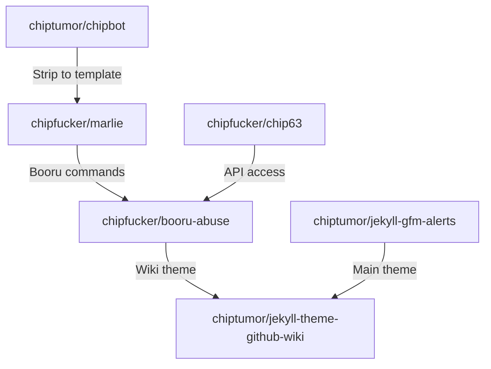

# Wuddup!

Call me Chip.

I use Github for various projects, but I'm still getting the hang of things. I haven't used it collaboratively yet *(but would like to eventually!)*.

I have a whole website about me at [chiptumor.github.io](https://chiptumor.github.io/?s). Check me out!

## Project hierarchy

I'm constantly working on several projects at a time&mdash;that is, _one_ project at a time, but with another in mind.
 
Each project depends on the project its arrow points to.

